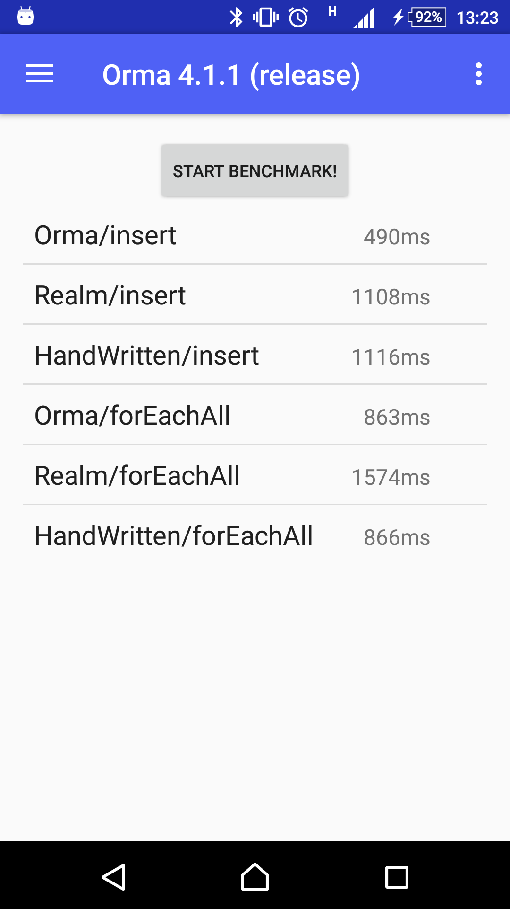

# Android Orma [](https://circleci.com/gh/gfx/Android-Orma/tree/master) [  ](https://bintray.com/gfx/maven/orma/) [](https://gitter.im/Android-Orma/Lobby)

<p align="center">

</p>

Orma is a ORM (Object-Relation Mapper) for [Android SQLiteDatabase](http://developer.android.com/reference/android/database/sqlite/SQLiteDatabase.html).
Because it generates helper classes at compile time with **annotation processing**, its query builders are type-safe.

The interface of Orma is simple and easy to use,
as the author respects the Larry Wall's wisdom:

> Easy things should be easy, and hard things should be possible
-- [Larry Wall](http://www.amazon.com/gp/feature.html?ie=UTF8&docId=7137)

## Table of Contents

<!-- TOC depthFrom:2 anchorMode:github.com -->

- [Table of Contents](#table-of-contents)
- [Motivation](#motivation)
- [Requirements](#requirements)
- [Getting Started](#getting-started)
- [Synopsis](#synopsis)
- [The Components](#the-components)
    - [Database Handles](#database-handles)
    - [Models](#models)
    - [Schema Helpers](#schema-helpers)
    - [Relation Helpers](#relation-helpers)
    - [Selector Helpers](#selector-helpers)
    - [Updater Helpers](#updater-helpers)
    - [Deleter Helpers](#deleter-helpers)
    - [Query Helper Methods](#query-helper-methods)
        - [List of Query Helper Methods](#list-of-query-helper-methods)
        - [How to Control Generation of Query Helpers](#how-to-control-generation-of-query-helpers)
    - [The Inserter Helpers](#the-inserter-helpers)
- [Details of Database Handles](#details-of-database-handles)
    - [Configuration of Database Handles](#configuration-of-database-handles)
    - [Database Handle Builders](#database-handle-builders)
    - [In-Memory Database](#in-memory-database)
- [Details of Models](#details-of-models)
    - [Setters and Getters](#setters-and-getters)
    - [Immutable Models](#immutable-models)
    - [Composite Indexes](#composite-indexes)
    - [Reserved Names](#reserved-names)
- [RxJava Integration](#rxjava-integration)
- [Associations](#associations)
    - [Has-One Associations with `SingleAssociation<T>`](#has-one-associations-with-singleassociationt)
    - [Direct Associations](#direct-associations)
    - [Has-Many Associations with `SingleAssociation<T>`](#has-many-associations-with-singleassociationt)
    - [Has-Many Associations with Direct Associations](#has-many-associations-with-direct-associations)
    - [Limitations in Associations](#limitations-in-associations)
- [Type Adapters](#type-adapters)
    - [How Serialized Types Used](#how-serialized-types-used)
    - [`@StaticTypeAdapters` for Multiple Serializers at Once](#statictypeadapters-for-multiple-serializers-at-once)
    - [Built-In Type Adapters](#built-in-type-adapters)
    - [Generic Type Adapters](#generic-type-adapters)
- [Pagination](#pagination)
    - [limit and offset](#limit-and-offset)
    - [page and per](#page-and-per)
- [Raw Queries](#raw-queries)
- [Migration](#migration)
- [DataSet Changed Events](#dataset-changed-events)
- [Cooperation with Serialization Libraries](#cooperation-with-serialization-libraries)
- [Example](#example)
- [Benchmark](#benchmark)
- [Method Count](#method-count)
- [FAQ](#faq)
    - [Can't build my project.](#cant-build-my-project)
    - [How can I enable debug logging on release build?](#how-can-i-enable-debug-logging-on-release-build)
    - [How can see the generated Java files?](#how-can-see-the-generated-java-files)
    - [Does Orma work with Kotlin?](#does-orma-work-with-kotlin)
    - [Does Orma work with the Jack compiler?](#does-orma-work-with-the-jack-compiler)
    - [When the database handle is opened and closed?](#when-the-database-handle-is-opened-and-closed)
    - [Who uses Orma?](#who-uses-orma)
- [Support](#support)
- [Licenses in Runtime Dependencies](#licenses-in-runtime-dependencies)
- [Contribution](#contribution)
- [Release Engineering for Maintainers](#release-engineering-for-maintainers)
- [See Also](#see-also)
- [Authors and Contributors](#authors-and-contributors)
- [License](#license)

<!-- /TOC -->

## Motivation

There are already [a lot of ORMs for Android](https://github.com/search?q=topic%3Aandroid+topic%3Aorm).
Why I have to add another wheel?

The answer is that I need an ORM that has *all* the following features:

* Fast as hand-written code
* POJO models
  * Model classes should have no restriction
  * Might implement `Parcelable` and/or extend any classes
  * They should be passed to another thread
* A database handle must be an object instance
  * Not a static-method based class
  * Even though it is designed to be used as a singleton scope
* Easy migration
  * Some `ALTER TABLE`, e.g. `add column` and `drop column`, should be detected and processed
  * There is a wheel in Perl: [SQL::Translator::Diff](https://metacpan.org/pod/SQL::Translator::Diff)
* Type safe and code completion friendly
  * `db.selectFromModel()` is better than `new Select(Model.class)`
  * `todos.idEq(id).toList()` is better than `todos.equalTo("id", id)`
* Custom raw queries are sometimes inevitable
  * `GROUP BY ... HAVING ...`
  * `SELECT max(value), min(value), avg(value), count(value) FROM ...`

And now they are exactly what Orma has.

## Requirements

* JDK 8 (1.8.0_66 or later) to build
* Android API level 15 to use

## Getting Started

Declare dependencies to use Orma and its annotation processor.

```gradle:build.gradle
dependencies {
    annotationProcessor 'com.github.gfx.android.orma:orma-processor:4.2.4'
    compile 'com.github.gfx.android.orma:orma:4.2.4'
}
```

NOTE: if you use Android Gradle Plugin before 2.2.0, you must use [android-apt](https://bitbucket.org/hvisser/android-apt) plugin instead of `annotationProcessor` configuration.

## Synopsis

First, define model classes annotated with `@Table`, `@Column`, and `@PrimaryKey` and run the **Build APK** command to generate helper classes.

```java
package com.github.gfx.android.orma.example;

import com.github.gfx.android.orma.annotation.Column;
import com.github.gfx.android.orma.annotation.PrimaryKey;
import com.github.gfx.android.orma.annotation.Table;

import android.support.annotation.Nullable;

@Table
public class Todo {

    @PrimaryKey(autoincrement = true)
    public long id;

    @Column(indexed = true)
    public String title;

    @Column
    @Nullable // allows NULL (default: NOT NULL)
    public String content;

    @Column
    public long createdTimeMillis;
}
```

Second, instantiate a database handle `OrmaDatabase`, which is generated by `orma-processor`.

Here is an example to configure `OrmaDatabase`:

```java
// See OrmaDatabaseBuilderBase for other options.
OrmaDatabase orma = OrmaDatabase.builder(context)
    .name("main.db") // default: "${applicationId}.orma.db"
    .build();
```

Then, you can create, read, update and delete models via `OrmaDatabase`:

```java
Todo todo = ...;

// create
orma.insertIntoTodo(todo);

// prepared statements with transaction
orma.transactionSync( -> { // or transactionAsync() to execute tasks in background
    Inserter<Todo> inserter = orma.prepareInsertIntoTodo();
    inserter.execute(todo);
});

// read
orma.selectFromTodo()
  .titleEq("foo") // equivalent to `where("title = ?", "foo")`
  .executeAsObservable() // first-class RxJava interface
  .subscribe(...);

// update
orma.updateTodo()
  .titleEq("foo")
  .content("a new content") // to setup what are updated
  .execute();

// delete
orma.deleteFromTodo()
  .titleEq("foo")
  .execute();
```

## The Components

### Database Handles

A database handle, named `OrmaDatabase` by default, is generated by `orma-processor`, which is an entry point of all the high-level database operations.

This is typically used as a singleton instance and you don't need to manage its lifecycle. That is, you don't need to explicitly close it.

### Models

A **model** in Orma is a Java class that is annotated with `@Table`, which
has at least one column, a field annotated with `@Column` or `@PrimaryKey`.

`orma-processor` generates helper classes for each model:
`Schema`, `Relation`, `Selector`, `Updater`, and `Deleter`.

Because these helper classes are generated at the compile time, you
can use Orma as a type-safe ORM.

### Schema Helpers

A Schema helper, e.g. `Todo_Schema`, has metadata for the corresponding model.

This is an internal helper class and not intended to be employed by users.

### Relation Helpers

A Relation helper, e.g. `Todo_Relation`, is an entry point of table operations.

This is created by a database handle:

```java
public static Todo_Relation relation() {
  return orma.relationOfTodo();
}
```

And is able to create `Selector`, `Updater`, `Deleter`, and `Inserter` for the target model.

```java
Todo_Relation todos = orma.relationOfTodo();

todos.selector().toList(); // Todo_Selector
todos.updater().content("foo").execute(); // Todo_Updater
todos.inserter().execute(todo); // Inserter<Todo>
todos.deleter().execute(); // Todo_Deleter
```

This can be a subset of a table which has `ORDER BY` clauses and `WHERE` clauses with some `List`-like methods:

```java
Todo_Relation todos = orma.relationOfTodo()
  .doneEq(false) // can have conditions
  .orderByCreatedTimeMillis(); // can have orders

// List-like features:
int count = todos.count();
Todo todo = todos.get(0);

// Convenience utilities
int position = todos.indexOf(todo);
todos.deleteWithTransactionAsObservable()
  .subscribeOn(Schedulers.io())
  .observeOn(AndroidSchedulers.mainThread())
  .subscribe(position -> {
    notifyItemRemoved(position); // assumes Adapter#notifyItemRemoved()
  })
todos.truncateWithTransactionAsObservable()
  .subscribeOn(Schedulers.io())
  .subscribe();

// Todo_Relation implements Iterable<Todo>
for (Todo todo : todos) {
  // ...
}
```

And has convenience `#upsert()` to "save it anyway", returning a new model:

```java
Todo_Relation todos = orma.relationOfTodo()

Todo newTodo = todos.upsert(todo); // INSERT if it's not persistent; UPDATE Otherwise
```

Unlike `INSERT` with `OnConflict.REPLACE`, `#upsert()` doesn't break associations.

NOTE: if you use a model after `#upsert()`, you must use the returned `newModel`.
This is because Orma does not change the model's primary key on `INSERT`.

### Selector Helpers

A `Selector` helper, e.g. `Todo_Selector`, is created by a `Relation`:

```java
Todo_Selector selector = relation().selector();
// or orma.selectFromTodo();
```

This is a query builder for `SELECT ... FROM *` statements.

### Updater Helpers

An `Updater` helper, e.g. `Todo_Updater`, is created by a `Relation`:

```java
Todo_Updater updater = relation().updater();
// or orma.updateTodo();
```

This is a query builder for `UPDATE *` statements.

### Deleter Helpers

A `Deleter` helper, e.g. `Todo_Deleter`, is created by a `Relation`:

```java
Todo_Deleter deleter = relation().deleter();
// or orma.deleteFromTodo();
```

This is a query builder for `DELETE FROM *` statements.

### Query Helper Methods

There are **Query Helpers** which are generated to query conditions and orders in a type-safe way.

For example, `titleEq()` shown in the synopsis section, are generated to help make `WHERE` and `ORDER BY` clauses,
for `Relation`, `Selecotr`, `Deleter`, and `Updater`.

Most of them are generated for columns with `indexed = true`, and some are for `@PrimaryKey` columns.

#### List of Query Helper Methods

Here is a list of Query Helpers that are generated for **all** the `indexed` columns, where `*` is a column name pladeholder:

| Method           | SQL                 |
|:----------------:|:-------------------:|
| `*Eq(value)`     | `* = value`         |
| `*NotEq(value)`  | `* <> value`        |
| `*In(values)`    | `* IN (values)`     |
| `*NotIn(values)` | `* NOT IN (values)` |

The following are generated for `@Nullable` columns.

| Method         | SQL             |
|:--------------:|:---------------:|
| `*IsNull()`    | `* IS NULL`     |
| `*IsNotNull()` | `* IS NOT NULL` |

The following are generated for numeric columns
 (i.e. `byte`, `short`, `int`, `long`, `float`, `double`, and their corresponding box types)

| Method           | SQL                 |
|:----------------:|:-------------------:|
| `*Lt(value)`     | `* < value`         |
| `*Le(values)`    | `* <= value`        |
| `*Gt(value)`     | `* > value`         |
| `*Ge(value)`     | `* >= value`        |
| `*Between(a, b)` | `* BETWEEN a AND b` |

And `ORDER BY` helpers:

| Method           | SQL               |
|:----------------:|:-----------------:|
| `orderBy*Asc()`  | `ORDER BY * ASC`  |
| `orderBy*Desc()` | `ORDER BY * DESC` |

#### How to Control Generation of Query Helpers

**This is an advanced setting for those who know what they do.**

You can control which Query Helpers are generater for a column by `@Column(helpers = ...)` attribute:

```java
@Column(
    helpers = Column.Helpers.AUTO // default to AUTO
)
```

Here are the definition of options defined in [Column.java](annotations/src/main/java/com/github/gfx/android/orma/annotation/Column.java):

```java
long AUTO = -1; // the default, a smart way
long NONE = 0;

long CONDITION_EQ = 0b01;
long CONDITION_NOT_EQ = CONDITION_EQ << 1;
long CONDITION_IS_NULL = CONDITION_NOT_EQ << 1;
long CONDITION_IS_NOT_NULL = CONDITION_IS_NULL << 1;
long CONDITION_IN = CONDITION_IS_NOT_NULL << 1;
long CONDITION_NOT_IN = CONDITION_IN << 1;

long CONDITION_LT = CONDITION_NOT_IN << 1;
long CONDITION_LE = CONDITION_LT << 1;
long CONDITION_GT = CONDITION_LE << 1;
long CONDITION_GE = CONDITION_GT << 1;
long CONDITION_BETWEEN = CONDITION_GE << 1;

long CONDITIONS = CONDITION_EQ | CONDITION_NOT_EQ | CONDITION_IS_NULL | CONDITION_IS_NOT_NULL
        | CONDITION_IN | CONDITION_NOT_IN
        | CONDITION_LT | CONDITION_LE | CONDITION_GT | CONDITION_GE | CONDITION_BETWEEN;

long ORDER_IN_ASC = CONDITION_BETWEEN << 1;
long ORDER_IN_DESC = ORDER_IN_ASC << 1;

long ORDERS = ORDER_IN_ASC | ORDER_IN_DESC;

long ALL = CONDITIONS | ORDERS;
```

### The Inserter Helpers

This is a prepared statement for `INSERT INTO ...` for bulk insertions.

```java
Inserter<Todo> inserter = relation().inserter();
// or orma.insertIntoTodo()

inserter.execute(todo);
inserter.executeAll(todos);
```

## Details of Database Handles

The section describes the details of database handles.

### Configuration of Database Handles

The database class is configured by the [`@Database`](https://github.com/gfx/Android-Orma/blob/master/annotations/src/main/java/com/github/gfx/android/orma/annotation/Database.java) annotation:

```java
@Database(
    databaseClassName = "OrmaDatabase", // default to "OrmaDatabase"
    includes = { /* ... */ } // Give model classes to handle
    excludes = { /* ... */ } // Give model classes not to handle
)
public class DatabaseConfiguration { }
```

The annotated class is not used for now, but the package is used to place the OrmaDatabase class.

### Database Handle Builders

`OrmaDatabase.builder(Context)` returns a builder isntance, which
has configure the database handle instance:

| Method                 | Description                 | Default             |
|:----------------------:|:---------------------------:|:-------------------:|
| `name(String)`         | The filename of SQLite DB   | `"${package}.orma.db"` |
| `migrationEngine(MigrationEngine)`| Custom migration engine | `OrmaMigration`  |
| `writeAheadLogging(boolean)`  | SQLite WAL flag      | `true`              |
| `foreignKeys(boolean)` | SQLite FOREIGN_KEYS flag    | `true`              |
| `migrationStep(int, ManualStepMigration.Step)` | A migration step | none   |
| `trace(boolean)`       | Output executed queries to logcat if true | dynamic (*1) |
| `readOnMainThread(AccessThreadConstraint)`  | Check read operation on main thread | dynamic (*2) |
| `writeOnMainThread(AccessThreadConstraint)` | Check write operation on main thread | dynaimc (*3) |

* **\*1** `BuildConfig.DEBUG ? true : false`
* **\*2** `BuildConfig.DEBUG ? WARN : NONE`
* **\*3** `BuildConfig.DEBUG ? FATAL : NONE`

Note that **Orma aborts if writing occurs on main thread** in debug build.

Use background threads, e.g. via `AsyncTask` for writing, or RxJava interfaces with `Schedulers.io()`.

Otherwise you can disable this behavior:

```java
OrmaDatabase orma = OrmaDatabase.builder(context)
    .writeOnMainThread(AccessThreadConstraint.NONE)
    .build();
```

### In-Memory Database

You can create in-memory databases by passing `null` to `OrmaDatabase.Builder#name()`.

This is useful for testhing.

## Details of Models

The section describes the details of model definition.

### Setters and Getters

Orma can use getters and setters if columns have corresponding methods.

You can also connect getters and setters with `@Getter` and `@Setter`
respectively, which tells `orma-processor` to use accessors.

Each accessor name can have a column name in SQLite databases,
which is inferred from its method name if omitted.

```java
@Table
public class KeyValuePair {

    static final String kKey = "Key";

    @Column(kKey) // specifies the name
    private String key;

    @Column // omits the name
    private String value;

    @Getter(kKey)
    public String getKey() {
        return key;
    }

    @Setter(kKey)
    public void setKey(String key) {
        this.key = key;
    }

    // used as a getter for the "value" column
    // @Getter is optional in this case
    public String getValue() {
        return value;
    }

    // used as a setter for the "value" column
    // @Setter is optional in this case
    public void setValue(String value) {
        this.value = value;
    }
}
```

### Immutable Models

Immutable models, where all the fields are declared with `final`, are supported
by annotating a constructor with `@Setter`.

```java
@Table
public class KeyValuePair {

    @Column
    public final String key;

    @Column
    public final String value;

    @Setter
    KeyValuePair(String key, String value) {
        this.key = key;
        this.value = value;
    }
}
```

It can be declared with custom names:

```java
@Table
public class KeyValuePair {
    static final String kKey = "Key";
    static final String kValue = "Value";

    @Column(kKey)
    public final String key;

    @Column(kValue)
    public final String value;

    KeyValuePair(@Setter(kKey) String key, @Setter(kValue) String value) {
        this.key = key;
        this.value = value;
    }
}
```

### Composite Indexes

There is the `indexes` parameter that `@Table` takes
in order to create composite indexes (a.k.a. multi-column indexes).

```java
// for CREATE INDEX:
@Table(indexes = @Index(value = {"resourceType", "resourceId"}))
public class Entry {

    @PrimaryKey
    public long id;

    @Column
    public String resourceType;

    @Column
    public long resourceId;
}
```


```java
// for CREATE UNIQUE INDEX:
@Table(
    indexes = @Index(
                value = {"resourceType", "resourceId"},
                unique = true
        )
)
public class Entry {

    @PrimaryKey
    public long id;

    @Column
    public String resourceType;

    @Column
    public long resourceId;
}
```

Composite indexes generate query helper methods only for `==` and `ORDER BY` for helper classes like the following:

* `Selector#resourceTypeAndResourceIdEq(String, long)`
* `Selector#orderByResourceTypeAndResourceIdAsc()`
* `Selector#orderByResourceTypeAndResourceIdDesc()`

You can control generated helpers with the `helpers` parameter.

See also [Query Helper Methods](#query-helper-methods).

### Reserved Names

Column names starting `$` are reserved for metadata.

Other names, including SQLite keywords, are allowed.

## RxJava Integration

RxJava integration provides a set of powerful API to transform, filter, and combine DB rows.

For example, there is a model named `Book` with `@Column(unique = true) String title`
and you'd like to get a `Map<String, Book>` where the key is `Book#title`:

```java
Map<String, Book> map = db.selectFromBook()
    .executeAsObservable()
        .toMap(new Function<Book, String>() {
            @Override
            public String apply(Book book) throws Exception {
                return book.title;
            }
        }).blockingGet();
```

## Associations

Two or more Orma models can be associated with **association** mechanism.

There are two type of associations: **has-one** and **has-many**.

In addition, there are another two kind of association supports: indirect associations with `SingleAssociation<T>` and direct associations.

### Has-One Associations with `SingleAssociation<T>`

There is `SingleAssociation<T>` to support has-one associations, which is retrieved on demand; this is useful if the associations are not always used.

For example, a book has a publisher:

```java
@Table
class Publisher {
  @PrimaryKey
  public long id;
}

@Table
class Book {

    @Column
    public SingleAssociation<Publisher> publisher;
}
```

To save this a book:

```java
Book book = new Book();
Publisher publisher = new Publisher();

long publisherId = db.insertIntoPublisher()
    .execute(publisher);

// if publisher has a valid primary key, `just(publisher)` is also okay.
book.publisher = SingleAssociation.just(publisherId);

db.insertIntoBook()
    .execute(book)
```

To get a publisher from books:

```java
db.selectFromBook()
    .forEach((book) -> {
        // blocking:
        Publisher publisher = book.publisher.get();

        // with RxJava Single<Publisher>:
        book.publisher.single()
            .subscribe((publisher) -> {
                // use publisher
            })
    });
```

### Direct Associations

There are _direct associations_, where an Orma model has another Orma model directly.

Given a `has-one` association, `Book has-one Publisher`:

```java
@Table
class Publisher {
  @PrimaryKey
  public long id;

  @Column
  public String name;
}

@Table
class Book {

    @PrimaryKey
    public long id;

    @column
    public String title;

    @Column
    public Publisher publisher;
}
```

The corresponding table definition is something like this:

```sql
CREATE TABLE `Publisher` (
  `id` INTEGER PRIMARY KEY,
  `name` TEXT NOT NULL
)
CREATE TABLE `Book` (
  `id` INTEGER PRIMARY KEY,
  `title` TEXT NOT NULL,
  `publisher` INTEGER NOT NULL
    REFERENCES `Publisher`(`id`) ON UPDATE CASCADE ON DELETE CASCADE
)
```

In SQL, `Book#publisher` refers `Publisher#id`, indicating the two tables
should be joined in `SELECT` statements.

In Java, `Book#publisher` is a `Publisher` instance, which is retrieved in each
`SELECT` operations. There is no lazy loading in direct associations.

### Has-Many Associations with `SingleAssociation<T>`

Has-many associations are not directly supported but you can define a method to get associated objects:

```java
@Table
class Publisher {
    @PrimaryKey
    public long id;

    // NOTE: If OrmaDatabase is a singleton, no parameter is required!
    public Book_Relation getBooks(OrmaDatabase db) {
        return db.relationOfBook().publisherEq(this);
    }
}

@Table
class Book {

    @Column(indexed = true)
    public SingleAssociation<Publisher> publisher;

}
```

### Has-Many Associations with Direct Associations

As `SingleAssociation` is, you can define a helper method to get has-many associations:

```java
@Table
class Publisher {
    @PrimaryKey
    public long id;

    // NOTE: If OrmaDatabase is a singleton, no parameter is required!
    public Book_Relation getBooks(OrmaDatabase db) {
        return db.relationOfBook().publisherEq(this);
    }
}

@Table
class Book {

    @Column(indexed = true)
    public Publisher publisher;

}
```

### Limitations in Associations

* There are no methods to query associated models

These issues will be fixed in a future.

## Type Adapters

Orma models are able to have embedded objects with **type adapters**, a.k.a. static type adapters,
by defining classes with `@StaticTypeAdapter` annotation.

For example, if you want to embed [LatLng](https://developers.google.com/android/reference/com/google/android/gms/maps/model/LatLng)
in your Orma model, you can define a type adapter like this:

```java
@StaticTypeAdapter(
    targetType = LatLng.class, // required
    serializedType = String.class // required
)
public class LatLngAdapter {

    // SerializedType serialize(TargetType source)
    @NonNull
    public static String serialize(@NonNull LatLng source) {
        return source.latitude + "," + source.longitude
    }

    // TargetType deserialize(SerializedType serialized)
    @NonNull
    public static LatLng deserialize(@NonNull String serialized) {
        String[] values = serialized.split(",");
        return new LatLng(
            Double.parseDouble(values[0]),
            Double.parseDouble(values[1]));
    }
}
```

`@StaticTypeAdapter` requires `targetType` and `serializedType` options and two static methods `SerializedType serialize(TargetType)` and `TargetType deserialize(SerializedType)`.

### How Serialized Types Used

A `@StaticTypeAdapter#serializedType` is bound to an SQLite storage type.
Thus it must be one of the "Java Type" listed the table below, where each "Java Type" has a corresponding "SQLite Type":

| Java Type | SQLite Type |
|:---------:|:-----------:|
| int       | INTEGER     |
| short     | INTEGER     |
| long      | INTEGER     |
| boolean   | INTEGER     |
| float     | REAL        |
| double    | REAL        |
| String    | TEXT        |
| byte[]    | BLOB        |

### `@StaticTypeAdapters` for Multiple Serializers at Once

You can also define multiple type serializers to single class with `@StaticTypeAdapters` annotation containers:

```java
@StaticTypeAdapters({
    @StaticTypeAdapter(
        targetType = MutableInt.class,
        serializedType = int.class,
        serializer = "serializeMutableInt",
        deserializer = "deserializeMutableInt"
    ),
    @StaticTypeAdapter(
        targetType = MutableLong.class,
        serializedType = long.class,
        serializer = "serializeMutableLong",
        deserializer = "deserializeMutableLong"
    )
})
public class TypeAdapters {

    public static int serializeMutableInt(@NonNull MutableInt target) {
        return target.value;
    }

    @NonNull
    public static MutableInt deserializeMutableInt(int deserialized) {
        return new MutableInt(deserialized);
    }

    public static long serializeMutableLong(@NonNull MutableLong target) {
        return target.value;
    }

    @NonNull
    public static MutableLong deserializeMutableLong(long deserialized) {
        return new MutableLong(deserialized);
    }
}
```

### Built-In Type Adapters

There are built-in type adapters for typically used value objects and collections:

* `java.math.BigDecimal`
* `java.math.BigInteger`
* `java.nio.ByteBuffer`
* `java.util.Currency`
* `java.util.Date`
* `java.sql.Date`
* `java.sql.Time`
* `java.sql.Timestamp`
* `java.util.UUID`
* `java.util.List<String>`
* `java.util.ArrayList<String>`
* `java.util.Set<String>`
* `java.util.HashSet<String>`
* `android.net.Uri`

### Generic Type Adapters

If your `deserialize()` takes a `Class<T>` parameter, the type serializer is _generic_, handling classes with the common base classe.

For example, if you have some enums that implement `EnumDescription`, e.g. `T extends Enum<T> & EnumDescription`, you can handle it with a generic type adapter.

Given an interface `EnumDescription`:

```java
public interface EnumDescription {

    long getValue();
}
```

And here is its type adapter:


```java
@StaticTypeAdapter(
        targetType = EnumDescription.class,
        serializedType = long.class
)
public class EnumTypeAdapter {

    public static <T extends Enum<T> & EnumDescription> long serialize(@NonNull T value) {
        return value.getValue();
    }

    @NonNull
    public static <T extends Enum<T> & EnumDescription> T deserialize(long serialized, @NonNull Class<T> type) {

        for (T enumValue : type.getEnumConstants()) {
            if (enumValue.getValue() == serialized) {
                return enumValue;
            }
        }

        throw new RuntimeException("Unknown id: " + serialized + " for " + type);
    }
}
```

Now `deserialize()` uses the type information for the conclete target class.

## Pagination

There are two style pagination. You can use either, but not mixed.

### limit and offset

SQL style pagination:

```java
for (Todo todo : orma.selectFromTodo().titleEq("buy").offset(0).limit(10)) {
    // ...
}
```

### page and per

"paging" style pagination inspired from Ruby's [kaminari](https://github.com/kaminari/kaminari).

```java
for (Todo todo : orma.selectFromTodo().titleEq("buy").page(1).per(10)) {
    // ...
}
```

Note that `page` starts from 1.

## Raw Queries

For low-level operations, e.g. executing a raw query, you can use
`OrmaDatabase#getConnection()`, which returns `OrmaConnection`.

For example:

```java
Cursor cursor = db.getConnection().rawQuery("SELECT max(bookId) as max_id, min(bookId) as min_id FROM Book");
cursor.moveToFirst();
// get data from cursor
cursor.close();
```

NOTE: Don't use `rawQuery()` for performance because Orma query builders are fast enough.

## Migration

There is a pluggable migration mechanism via the `MigrationEngine` interface.

The default migration engine is `SchemaDiffMigration`, which handles
schema changes by making diff with old and new DDL stored in `sqlite_master`.
That is, you don't need migration steps for the following cases:

* Adding tables
* Adding columns
* Changing column types
* Changing column constraints (`NOT NULL`, `UNIQUE`, and etc.)

Of course, you can define migration steps for each schema version (or `BuildConfig.VERSION`).

Here is an example to define migration steps:

```java
int VERSION_2; // a past version of VERSION_CODE

OrmaDatabase orma = OrmaDatabase.builder(this)
        .migrationStep(VERSION_2, new ManualStepMigration.ChangeStep() {
            @Override
            public void change(@NonNull ManualStepMigration.Helper helper) {
              Log.(TAG, helper.upgrade ? "upgrade" : "downgrade");
              helper.execSQL("DROP TABLE foo");
              helper.execSQL("DROP TABLE bar");
            }
        })
        // ... other configurations
        .build();
```

See [migration/README.md](migration/README.md) for details.

## DataSet Changed Events

NOTE: **This is experimental in v4.2.4: its existence, signature or behavior might change without warning from one release to the next.**

`Relation#createQueryObservable()` can create a event stream to observe data-set changed events for the relation.

This likes [SQLBrite](https://github.com/square/sqlbrite)'s' "Query Observable", whereas Orma's does not notify the initial event.

```java
// NOTE: Keep the observable instance. If it's released, the observable is disposed.

// create a query observable, which is a hot observable
Observable<Author_Selector> observable = db.relationOfAuthor()
        .createQueryObservable();

// subscribe the events
observable.flatMap(new Function<Author_Selector, Observable<Author>>() {
    @Override
    public Observable<Author> apply(Author_Selector selector) throws Exception {
        Log.d(TAG, "Author has been changed!");
        return selector.executeAsObservable();
    }
})
        .map(new Function<Author, String>() {
            @Override
            public String apply(Author author) throws Exception {
                return author.name;
            }
        })
        .subscribe(new Consumer<String>() {
            @Override
            public void accept(String name) throws Exception {
                Log.d(TAG, "name: " + name);
            }
        });
```

See `OrmaListAdapter` and `OrmaRecyclerViewAdapter`, which use Query Observables to
trigger `#notifyDataSetChanged()`.

* [OrmaListAdapter](https://github.com/gfx/Android-Orma/blob/master/library/src/main/java/com/github/gfx/android/orma/widget/OrmaListAdapter.java)
* [OrmaRecyclerViewAdapter](https://github.com/gfx/Android-Orma/blob/master/library/src/main/java/com/github/gfx/android/orma/widget/OrmaRecyclerViewAdapter.java)

## Cooperation with Serialization Libraries

Beause Orma reuqires nothing to do to models, serializers, e.g. Android Parcels or GSON, can
serialize Orma models.

## Example

There is [an example app](example/) to demonstrate:

* Migration
* Orma with `RecyclerView` / `ListView`
* Benchmark (see below)

## Benchmark

There is a simple benchmark with [Realm](https://github.com/realm/realm-java) and hand-written SQLiteDatabase code:

[example/BenchmarkFragment](example/src/main/java/com/github/gfx/android/orma/example/fragment/BenchmarkFragment.java)

Here is a result performed on Android 6.0.0 / Xperia Z4
as of Orma v4.2.4 and Realm 2.3.0, processing 10 items x 100 times:



I welcome benchmark in another condition and/or another code.

## Method Count

Orma runtime is very lightweight: [Method Count for v4.2.4](http://www.methodscount.com/?lib=com.github.gfx.android.orma:orma:4.2.4)

## FAQ

### Can't build my project.

Check your toolchain. FYI here are my toolchain versions:

* JDK 1.8.0_66
* Android SDK Tools 25 or later
* Android SDK Platform Tools 24 or later
* Android SDK Build Tools 24 or later
* Android Gradle Plugin 2.2.0 or later

### How can I enable debug logging on release build?

Call `OrmaDatabase.Builder#trace(boolean)` with `true`:

```java
OrmaDatabase orma = OrmaDatabase.builder(context)
    .trace(true)
    .create();
```

This option also enables logging in the default migration engine.

If you give a custom migration engine to the orma builder, you have to enable
`trace` flag to its constructor:

```java
boolean trace = true;
SchemaDiffMigration migration = new SchemaDiffMigration(context, trace);
```

### How can see the generated Java files?

As other annotation processors do, Orma save files to `$modle/build/generated/source/apt/`.

You can see [generated files for example models](example/build/generated/source/apt/debug/com/github/gfx/android/orma/example/orma).

### Does Orma work with Kotlin?

Yes, but it's _experimental_. Here is an example to use Orma with Kotlin:

https://github.com/gfx/OrmaWithKotlin

NOTE: Kotlin APT support, a.k.a. _kapt_, is **really unstable**. Don't ask me how to solve kapt problems.

### Does Orma work with the Jack compiler?

Yes. As of Android Gradle Plugin 2.2.2, Orma should work with Jack.

```gradle:build.gradle
dependencies {
    annotationProcessor 'com.github.gfx.android.orma:orma-processor:4.2.4'
    compile 'com.github.gfx.android.orma:orma:4.2.4'
}
```

See https://github.com/gfx/OrmaWithJack for a working example.

### When the database handle is opened and closed?

Orma opens the database handle in instantiating `OrmaDatabase`, and you don't need to
close it.

In other word, you can define the database handle as a singleton instance in your application scope,
and forget `close`.

### Who uses Orma?

Here is a list of open-source Androdi apps using Orma which are released to Google Play:

* [gfx/Android-Helium](https://github.com/gfx/Android-Helium)
* [DroidKaigi/conference-app-2017](https://github.com/DroidKaigi/conference-app-2017)

Or you can search use cases by [GitHub search](https://github.com/search?o=desc&q=%22com.github.gfx.android.orma%22+filename%3Abuild.gradle&ref=searchresults&s=indexed&type=Code&utf8=%E2%9C%93).

Also, here is a list of apps using Orma which are proprietary:

* [Cookpad (ja)](https://play.google.com/store/apps/details?id=com.cookpad.android.activities)
* [Abema TV (ja)](https://play.google.com/store/apps/details?id=tv.abema)

Tell me if your projects use Orma!

## Support

* Use [GitHub issues](https://github.com/gfx/Android-Orma/issues) for the issue tracker
* Feel free to ask for questions to the author [@\_\_gfx\_\_](https://twitter.com/__gfx__)
* Gitter Rooms:
    * https://gitter.im/Android-Orma/Lobby (en)
    * https://gitter.im/Android-Orma/Ja (ja)

## Licenses in Runtime Dependencies

* https://github.com/ReactiveX/RxJava - Apache Software License 2.0
* [bkiers/sqlite-parser](https://github.com/bkiers/sqlite-parser) - The MIT License
  * The original code of [SQLite.g4](sqliteparser/src/main/antlr/com/github/gfx/android/orma/sqliteparser/g/SQLite.g4)

## Contribution

Patches are welcome!

## Release Engineering for Maintainers

```shell
./gradlew bumpMajor # or bumpMinor / bumpPatch
git add -va
make publish # run tests, build artifacts, publish to jcenter, and make a tag
```

Visual Studio Code (a.k.a. vscode) is recommended to edit README.md and CHANGELOG.md. Especially the ToC section is managed by [AlanWalk/Markdown-TOC](https://github.com/AlanWalk/Markdown-TOC).

## See Also

* [SQLite](http://sqlite.org/)
* [SQLiteDatabase](http://developer.android.com/reference/android/database/sqlite/SQLiteDatabase.html)
* [Version of SQLite used in Android? - Stack Overflow](http://stackoverflow.com/questions/2421189/version-of-sqlite-used-in-android)

## Authors and Contributors

FUJI Goro ([gfx](https://github.com/gfx)).

And contributors are listed here: [Contributors](https://github.com/gfx/Android-Orma/graphs/contributors)

## License

Copyright (c) 2015 FUJI Goro (gfx).

Licensed under the Apache License, Version 2.0 (the "License");
you may not use this file except in compliance with the License.
You may obtain a copy of the License at

http://www.apache.org/licenses/LICENSE-2.0

Unless required by applicable law or agreed to in writing, software
distributed under the License is distributed on an "AS IS" BASIS,
WITHOUT WARRANTIES OR CONDITIONS OF ANY KIND, either express or implied.
See the License for the specific language governing permissions and
limitations under the License.
