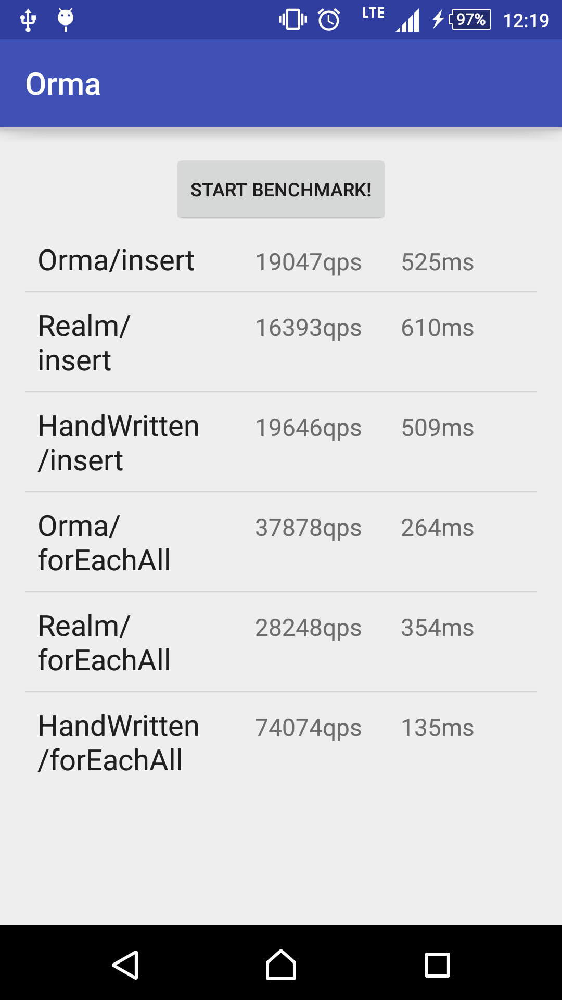

# Orma for Android [](https://circleci.com/gh/gfx/Android-Orma/tree/master) [  ](https://bintray.com/gfx/maven/orma/)

This is an **alpha** software and the interface will change until v1.0.0, which will be released Jan 2016.

> Easy things should be easy, and hard things should be possible
-- [Larry Wall](http://www.amazon.com/gp/feature.html?ie=UTF8&docId=7137)

Orma is an ORM (Object-Relation Mapper) for [Android SQLiteDatabase](http://developer.android.com/reference/android/database/sqlite/SQLiteDatabase.html),
generating helper classes at compile time with **annotation processing**.

* As fast as hand-written code with `SQLiteOpenHelper`
* Annotation-based schema definitions
* Semi-automatic migration

# Install

Orma requires **JDK 8 (1.8.0_66 or later)** and **Android API level 15**.

```groovy
// To use "apt" in dependencies

buildscript {
    repositories {
        jcenter()
    }
    dependencies {
        classpath 'com.neenbedankt.gradle.plugins:android-apt:1.8'
    }
}

apply plugin: 'com.neenbedankt.android-apt'
```

```groovy
// To use orma in your Android applications or libraries

dependencies {
    apt 'com.github.gfx.android.orma:orma-processor:0.22.0'
    compile 'com.github.gfx.android.orma:orma:0.22.0'
}
```

# Synopsis

First, define model classes annotated with `@Table`, `@Column`, and `@PrimaryKey`.

```java
package com.github.gfx.android.orma.example;

import com.github.gfx.android.orma.annotation.Column;
import com.github.gfx.android.orma.annotation.PrimaryKey;
import com.github.gfx.android.orma.annotation.Table;

import android.support.annotation.Nullable;

@Table
public class Todo {

    @PrimaryKey
    public long id;

    @Column(indexed = true)
    public String title;

    @Column
    @Nullable // allows NULL (default: NOT NULL)
    public String content;

    @Column
    public long createdTimeMillis;
}
```

Second, create a database handle `OrmaDatabase`, which is generated by `orma-processor`.

To make it:

```java
// see OrmaConfiguration for options
// each value is the default.
OrmaDatabase orma = OrmaDatabase.builder(context)
    .name(context.getPackageName() + ".orma.db") // optional
    .migrationEngine(new SchemaDiffMigration(context, BuildConfig.DEBUG)) // optional
    .typeAdapters(TypeAdapterRegistry.defaultTypeAdapters()) // optional
    .writeAheadLogging(true) // optional
    .trace(BuildConfig.DEBUG) // optional
    .readOnMainThread(AccessThreadConstraint.WARNING) // optional
    .writeOnMainThread(AccessThreadConstraint.FATAL) // optional
    .build();
```

Then, you can create, read, update and delete models:

```java
Todo todo = ...;

// create
orma.insertIntoTodo(todo);

// prepared statements with transaction
orma.transactionSync( -> { // or transactionAsync() to execute tasks in background
    Inserter<Todo> inserter = orma.prepareInsertIntoTodo();
    inserter.execute(todo);
});

// read
orma.selectFromTodo()
  .titleEq("foo") // equivalent to `where("title = ?", "foo")`
  .executeAsObservable() // first-class RxJava interface
  .subscribe(...);

// update
orma.updateTodo()
  .titleEq("foo")
  .content("a new content") // to setup what are updated
  .execute();

// delete
orma.deleteFromTodo()
  .titleEq("foo")
  .execute();
```

Note that **Orma checks DB access on main thread** in debug build by default.
Use background threads explicitly or RxJava interfaces with `Schedulers.io()`.

# Description

There are already [a lot of ORMs](https://android-arsenal.com/tag/69). Why I have to add another?

The answer is that I need ORM that have the following features:

* As fast as hand-written code
* POJO models
  * That is, model classes must have no restriction
  * Might implement `Parcelable` and/or extend any classes
  * They should be passed to another thread
* Database handles must be instances
  * Not a singleton nor static-method based class
* Semi-automatic migration
  * For what can be detected logically
  * i.e. simple `add column` and `drop column`
* Code completion friendly
  * `selectFromModel()` is better than `selectFrom(Model.class)`
* Custom queries
  * `GROUP BY ... HAVING ...`
  * `SELECT max(value), min(value), avg(value) FROM ...`

They are just what Orma has. This is as fast as hand-written code, its models have no restriction, database handle is
not a singleton, and has `SchemaDiffMigration` for automatic migration.

# Database Handles

A database handle, named `OrmaDatabase`, is generated by `orma-processor`,
which is an entry point of all the high-level database operations.

For low-level operations, e.g. executing a raw SQL, you can also use
`OrmaDatabase#getConnection()`, which returns `OrmaConnection`.

# Models

A **model** in Orma is a Java class that is annotated with `@Table`, which
has at least one field annotated with `@Column` or `@PrimaryKey`.

`orma-processor` generates a `OrmaDatabase` class and helper classes for
 each model: `Schema`, `Relation`, `Updater`, and `Deleter`.

Because these helper classes are generated at the compile time, you
can use Orma as a type-safe ORM.

## Schema Helper

A Schema helper, e.g. `Todo_Schema`, has metadata for the corresponding model.

This is an internal helper class, which is not intended to be used by users.

## Selector Helper

A Selector helper, e.g. `Todo_Selector`, is created by the database handle:

```java
Todo_Selector selector = orma.selectFromTodo();
```

This is a query builder for `SELECT ... FROM *` statements.

## Updater Helper

An Updater helper, e.g. `Todo_Updater`, is created by the database handle:

```java
Todo_Updater updater = orma.updateTodo();
```

This is a query builder for `UPDATE *` statements.

## Deleter Helper

A Delete helper, e.g. `Todo_Deleter`, is created by the database handle:

```java
Todo_Deleter deleter = orma.deleteFromTodo();
```

This is a query builder for `DELETE FROM *` statements.

## Insert Helper

An Insert helper is created by the database handle:

```java
Insert<Todo> inserter = orma.prepareInsertIntoTodo();
```

This is a prepared statement to execute `INSERT * INTO ...` statements.

## Relation Helper

A Relation helper, e.g. `Todo_Relation`, is created by the database handle:

```java
Todo_Relation relation = orma.relationOfTodo();
```

This is able to create Selector, Updater, Deleter, and Inserter of the specified model. In other words, an entry point of model helpers.

```java
Todo_Relation todos = orma.relationOfTodo();

todos.selector().toList(); // Todo_Selector
todos.updater().content("foo").execute(); // Todo_Updater
todos.inserter().execute(todo); // Inserter<Todo>
todos.deleter().execute(); // Todo_Deleter
```

This is also a subset of a table which has `ORDER BY` clauses and `WHERE` clauses with some `List`-like methods:

```java
Todo_Relation todos = orma.relationOfTodo()
  .doneEq(false) // can have conditions
  .orderByCreatedTimeMillis(); // can have orders

// List-like features:
int count = todos.count();
Todo todo = todos.get(0);

// Convenience utilities
int position = todos.indexOf(todo);
todos.deleteAsObservable(position -> {
    if (position != -1) {
      notifyItemRemoved(position); // assumes Adapter#notifyItemRemoved()
    }
});

// as Iterable<Todo>
for (Todo todo : todos) {
  // ...
}
```

## Condition Query Helpers

There are Condition Query Helpers, e.g. `titleEq()` shown in the synopsis
section, which are methods to help make `WHERE` and `ORDER BY` clauses,
generated for columns with `indexed = true` or the `@PrimaryKey` column.

Here is a list of Condition Query Helpers that are generated for all the `indexed` columns:

* `*Eq(value)` to make `WHERE * = ?`, which is also generated for `@PrimaryKey`
* `*NotEq(values)` to make `WHERE * <> ?`
* `*In(values)` to make `WHERE * IN (?, ?, ?, ...)`
* `*In(values)` to make `WHERE * NOT IN (?, ?, ?, ...)`

The following are generated for `@Nullable` columns.

* `*IsNull()` to make `WHERE * IS NULL`
* `*IsNotNull()` to make `WHERE * IS NOT NULL`

The following are generated for numeric columns
 (i.e. `byte`, `short`, `int`, `long`, `float`, `double`, and their corresponding box types)

* `*Lt(value)` to make `WHERE * < ?`
* `*Le(value)` to make `WHERE * <= ?`
* `*Gt(value)` to make `WHERE * > ?`
* `*Ge(value)` to make `WHERE * >= ?`

And `ORDER BY` helpers:

* `orderBy*Asc()` to make `ORDER BY * ASC`
* `orderBy*Desc()` to make `ORDER BY * DESC`

## Setters and Getters

Orma uses getters and setters if their names are inferred.

You can also connect getters and setters with `@Getter` and `@Setter` respectively,
which tells `orma-processor` to use accessors.

Each accessor name can specify a column name in SQLite database,
which is inferred from its method name if omitted.

```java
@Table
public class KeyValuePair {

    static final String kKey = "key";

    @Column(kKey) // specifies the name
    private String key;

    @Column // omits the name
    private String value;

    @Getter(kKey)
    public String getKey() {
        return key;
    }

    @Setter(kKey)
    public void setKey(String key) {
        this.key = key;
    }

    @Getter // getter for the "value" column
    public String getValue() {
        return value;
    }

    @Setter // setter for the "value" column
    public void setValue(String value) {
        this.value = value;
    }
}
```

## Immutable Models

Immutable models, where all the fields are declared with `final`, are supported
by annotating a constructor with `@Setter`.

```java
@Table
public class KeyValuePair {

    @Column
    public final String key;

    @Column
    public final String value;

    @Setter
    KeyVakuePair(String key, String value) {
        this.key = key;
        this.value = value;
    }
}
```

# Migration

Orma has pluggable migration mechanism via the `MigrationEngine` interface.

The default migration engine is `SchemaDiffMigration`, which handles
schema changes by making diff with old and new table definitions.

You can set a custom migration engine to `OrmaDatabase` builders:

```java
class CustomMigrationEngine implements MigrationEngine { ... }

OrmaDatabase orma = OrmaDatabase.builder(context)
  .migrationEngine(new CustomMigrationEngine())
  .build();
```

See [migration/README.md](migration/README.md) for details.

# Type Adapters

Type adapters, which serializes and deserializes custom classes, are supported.

If you use type adapters, you can add them to `OrmaDatabase`:

```java
class FooAdapter extends AbstractTypeAdapter<Foo> {
    @Override
    @NonNull
    public String serialize(@NonNull Foo source) {
        return ... serialize ...;
    }

    @Override
    @NonNull
    public Foo deserialize(@NonNull String serialized) {
        return ... deserialize ...;
    }
}

OrmaDatabase orma = OrmaDatabase.builder(context)
    .addTypeAdapters(new FooAdapter())
    .build();
```

**The interface is alpha quality and are likely to change.**

## Built-In Type Adapters

There are a lot of built-in type adapter provided by default, which include:

* `StringListAdapter` for `List<String>`
* `StringSetAdapter` for `Set<String>`
* `DateAdapter` for `Date`
* `UriAdapter` for `Uri`

See [adapter/](library/src/main/java/com/github/gfx/android/orma/adapter)
for all the adapters.

# Example

There is an example app to demonstrate what Orma does.

It also includes a simple benchmark with Realm and hand-written SQLiteDatabase
operations.

See [example/](example/) for details.

# Benchmark

There is a simple benchmark with [Realm](https://github.com/realm/realm-java) and hand-written code:

[example/BenchmarkActivity](example/src/main/java/com/github/gfx/android/orma/example/activity/BenchmarkActivity.java)

Here is a result performed on Android 5.0.2 / Xperia Z4
as of Orma v0.9.0 and Realm 0.86.0:



# Support

* Use [GitHub issues](https://github.com/gfx/Android-Orma/issues) for the issue tracker
* Feel free to ask for questions to the author [@\_\_gfx\_\_](https://twitter.com/__gfx__)

# Licenses in Runtime Dependencies

* https://github.com/ReactiveX/RxJava - Apache Software License 2.0
* [bkiers/sqlite-parser](https://github.com/bkiers/sqlite-parser) - The MIT License
  * The original code of [SQLite.g4](sqliteparser/src/main/antlr/com/github/gfx/android/orma/sqliteparser/g/SQLite.g4)

# Release Engineering for Maintainers

```shell
./gradlew bumpMajor # or bumpMinor / bumpPatch
make publish # does release engineering
```

# See Also

* [SQLite](http://sqlite.org/)
* [SQLiteDatabase](http://developer.android.com/reference/android/database/sqlite/SQLiteDatabase.html)
* [Version of SQLite used in Android? - Stack Overflow](http://stackoverflow.com/questions/2421189/version-of-sqlite-used-in-android)

# Author

FUJI Goro ([gfx](https://github.com/gfx)).

# License

Copyright (c) 2015 FUJI Goro (gfx).

Licensed under the Apache License, Version 2.0 (the "License");
you may not use this file except in compliance with the License.
You may obtain a copy of the License at

http://www.apache.org/licenses/LICENSE-2.0

Unless required by applicable law or agreed to in writing, software
distributed under the License is distributed on an "AS IS" BASIS,
WITHOUT WARRANTIES OR CONDITIONS OF ANY KIND, either express or implied.
See the License for the specific language governing permissions and
limitations under the License.
