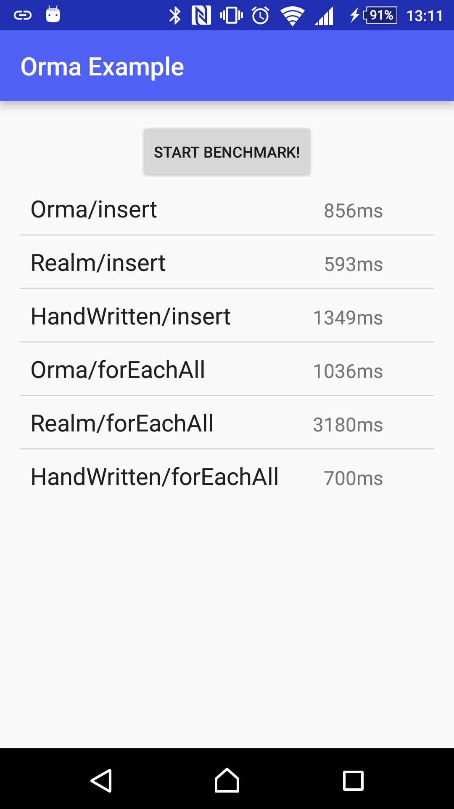

# Android Orma [](https://circleci.com/gh/gfx/Android-Orma/tree/master) [  ](https://bintray.com/gfx/maven/orma/)

<p align="center">

</p>

Orma is an ORM (Object-Relation Mapper) for [Android SQLiteDatabase](http://developer.android.com/reference/android/database/sqlite/SQLiteDatabase.html),
generating helper classes at compile time with **annotation processing**, inspired in ActiveAndroid, GreenDAO, and Realm.

The interface of Orma is very simple and easy to use,
as the author respects the Larry Wall's wisdom:

> Easy things should be easy, and hard things should be possible
-- [Larry Wall](http://www.amazon.com/gp/feature.html?ie=UTF8&docId=7137)

## Motivation

There are already [a lot of ORMs](https://android-arsenal.com/tag/69). Why I have to add another wheel?

The answer is that I need ORM that have *all* the following features:

* Fast as hand-written code
* POJO models
  * That is, model classes have no restriction
  * Might implement `Parcelable` and/or extend any classes
  * They should be passed to another thread
* A database handle must be an object instance
  * Not a singleton nor static-method based class
* Easy migration
  * For what can be detected logically
  * i.e. simple `add column` and `drop column`
  * There is a wheel in Perl: [SQL::Translator::Diff](https://metacpan.org/pod/SQL::Translator::Diff)
* Code completion friendly
  * `db.selectFromModel()` is better than `new Select(Model.class)`
* Custom queries
  * `GROUP BY ... HAVING ...`
  * `SELECT max(value), min(value), avg(value), count(value) FROM ...`

Now they are just what Orma has.

## Requirements

* JDK 8 (1.8.0_66 or later) to build with annotation processors
* Android API level 15 to use

## Getting Started

First, you need `android-apt` to use annotation processors in android projects.

```groovy
buildscript {
    repositories {
        jcenter()
    }
    dependencies {
        classpath 'com.neenbedankt.gradle.plugins:android-apt:1.8'
    }
}

apply plugin: 'com.neenbedankt.android-apt'

repositories {
    jcenter()
}
```

Then, declare dependencies to use Orma.

```groovy
dependencies {
    apt 'com.github.gfx.android.orma:orma-processor:2.6.0'
    compile 'com.github.gfx.android.orma:orma:2.6.0'
}
```

## Synopsis

First, define model classes annotated with `@Table`, `@Column`, and `@PrimaryKey` and run the **Build APK** command to generate helper classes.

```java
package com.github.gfx.android.orma.example;

import com.github.gfx.android.orma.annotation.Column;
import com.github.gfx.android.orma.annotation.PrimaryKey;
import com.github.gfx.android.orma.annotation.Table;

import android.support.annotation.Nullable;

@Table
public class Todo {

    @PrimaryKey
    public long id;

    @Column(indexed = true)
    public String title;

    @Column
    @Nullable // allows NULL (default: NOT NULL)
    public String content;

    @Column
    public long createdTimeMillis;
}
```

Second, create a database handle `OrmaDatabase`, which is generated by `orma-processor`.

Here is an example to configure `OrmaDatabase`:

```java
// See OrmaDatabaseBuilderBase for other options.
OrmaDatabase orma = OrmaDatabase.builder(context)
    .build();
```

Then, you can create, read, update and delete models via `OrmaDatabase`:

```java
Todo todo = ...;

// create
orma.insertIntoTodo(todo);

// prepared statements with transaction
orma.transactionSync( -> { // or transactionAsync() to execute tasks in background
    Inserter<Todo> inserter = orma.prepareInsertIntoTodo();
    inserter.execute(todo);
});

// read
orma.selectFromTodo()
  .titleEq("foo") // equivalent to `where("title = ?", "foo")`
  .executeAsObservable() // first-class RxJava interface
  .subscribe(...);

// update
orma.updateTodo()
  .titleEq("foo")
  .content("a new content") // to setup what are updated
  .execute();

// delete
orma.deleteFromTodo()
  .titleEq("foo")
  .execute();
```

Note that **Orma checks DB access on main thread** in debug build by default.
Use background threads explicitly or RxJava interfaces with `Schedulers.io()`.

## The Components

### Database Handles

A database handle, named `OrmaDatabase`, is generated by `orma-processor`,
which is an entry point of all the high-level database operations.

For low-level operations, e.g. executing a raw SQL, you can also use
`OrmaDatabase#getConnection()`, which returns `OrmaConnection`.

The database class is configured by `@Database` annotation:

```java
@Database(
    databaseClassName = "OrmaDatabase",
    includes = { /* ... */ } // Give model classes to handle
    excludes = { /* ... */ } // Give model classes not to handle
)
// The annotated class is not used, but the package name is used to place the OrmaDatabase class.
public class DatabaseConfiguration { }
```

### Models

A **model** in Orma is a Java class that is annotated with `@Table`, which
has at least one field annotated with `@Column` or `@PrimaryKey`.

`orma-processor` generates a `OrmaDatabase` class and helper classes for
 each model: `Schema`, `Relation`, `Updater`, and `Deleter`.

Because these helper classes are generated at the compile time, you
can use Orma as a type-safe ORM.

### Schema Helper

A Schema helper, e.g. `Todo_Schema`, has metadata for the corresponding model.

This is an internal helper class, which is not intended to be used by users.

### Relation Helper

A Relation helper, e.g. `Todo_Relation`, is a table manipulator with conditions
and orderings.

This is created by the database handle:

```java
public static Todo_Relation relation() {
  return orma.relationOfTodo();
}
```

This is able to create `Selector`, `Updater`, `Deleter`, and `Inserter` of the specified model. In other words, this is an entry point of model helpers.

```java
Todo_Relation todos = orma.relationOfTodo();

todos.selector().toList(); // Todo_Selector
todos.updater().content("foo").execute(); // Todo_Updater
todos.inserter().execute(todo); // Inserter<Todo>
todos.deleter().execute(); // Todo_Deleter
```

This is also a subset of a table which has `ORDER BY` clauses and `WHERE` clauses with some `List`-like methods:

```java
Todo_Relation todos = orma.relationOfTodo()
  .doneEq(false) // can have conditions
  .orderByCreatedTimeMillis(); // can have orders

// List-like features:
int count = todos.count();
Todo todo = todos.get(0);

// Convenience utilities
int position = todos.indexOf(todo);
todos.deleteWithTransactionAsObservable()
  .subscribeOn(Schedulers.io())
  .observeOn(AndroidSchedulers.mainThread())
  .subscribe(position -> {
    notifyItemRemoved(position); // assumes Adapter#notifyItemRemoved()
  })
todos.truncateWithTransactionAsObservable()
  .subscribeOn(Schedulers.io())
  .subscribe();

// Todo_Relation implements Iterable<Todo>
for (Todo todo : todos) {
  // ...
}
```

### Selector Helper

A `Selector` helper, e.g. `Todo_Selector`, is created by the database handle:

```java
Todo_Selector selector = relation().selector();
// or orma.selectFromTodo();
```

This is a query builder for `SELECT ... FROM *` statements.

### Updater Helper

An `Updater` helper, e.g. `Todo_Updater`, is created by the database handle:

```java
Todo_Updater updater = relation().updater();
// or orma.updateTodo();
```

This is a query builder for `UPDATE *` statements.

### Deleter Helper

A `Delete` helper, e.g. `Todo_Deleter`, is created by the database handle:

```java
Todo_Deleter deleter = relation().deleter();
// or orma.deleteFromTodo();
```

This is a query builder for `DELETE FROM *` statements.

## Query Helpers

There are Query Helpers which are generated to query conditions and orders in a type-safe way

For example, `titleEq()` shown in the synopsis section, are generated to help make `WHERE` and `ORDER BY` clauses,
for `Relation`, `Selecotr`, `Deleter`, and `Updater`.

They are generated for columns with `indexed = true` or the `@PrimaryKey` column.

Here is a list of Query Helpers that are generated for all the `indexed` columns:

* `*Eq(value)` to make `WHERE * = ?`, which is also generated for `@PrimaryKey`
* `*NotEq(values)` to make `WHERE * <> ?`
* `*In(values)` to make `WHERE * IN (?, ?, ?, ...)`
* `*NotIn(values)` to make `WHERE * NOT IN (?, ?, ?, ...)`

The following are generated for `@Nullable` columns.

* `*IsNull()` to make `WHERE * IS NULL`
* `*IsNotNull()` to make `WHERE * IS NOT NULL`

The following are generated for numeric columns
 (i.e. `byte`, `short`, `int`, `long`, `float`, `double`, and their corresponding box types)

* `*Lt(value)` to make `WHERE * < ?`
* `*Le(value)` to make `WHERE * <= ?`
* `*Gt(value)` to make `WHERE * > ?`
* `*Ge(value)` to make `WHERE * >= ?`

And `ORDER BY` helpers:

* `orderBy*Asc()` to make `ORDER BY * ASC`
* `orderBy*Desc()` to make `ORDER BY * DESC`

### Control Generation of Query Helpers

**This is an advanced setting for those who know what they do.**

You can control which Query Helpers are generater for a column by `@Column(helpers = ...)` attribute:

```java
@Column(
    helpers = Column.Helpers.AUTO // default to AUTO
)
```

Here are the definition of options defined in [Column.java](annotations/src/main/java/com/github/gfx/android/orma/annotation/Column.java):

```java
long AUTO = -1; // the default, a smart way
long NONE = 0;

long CONDITION_EQ = 0b01;
long CONDITION_NOT_EQ = CONDITION_EQ << 1;
long CONDITION_IS_NULL = CONDITION_NOT_EQ << 1;
long CONDITION_IS_NOT_NULL = CONDITION_IS_NULL << 1;
long CONDITION_IN = CONDITION_IS_NOT_NULL << 1;
long CONDITION_NOT_IN = CONDITION_IN << 1;

long CONDITION_LT = CONDITION_NOT_IN;
long CONDITION_LE = CONDITION_LT;
long CONDITION_GT = CONDITION_LE;
long CONDITION_GE = CONDITION_GT;
long CONDITION_BETWEEN = CONDITION_GE;

long CONDITIONS = CONDITION_EQ | CONDITION_NOT_EQ | CONDITION_IS_NULL | CONDITION_IS_NOT_NULL
        | CONDITION_IN | CONDITION_NOT_IN
        | CONDITION_LT | CONDITION_LE | CONDITION_GT | CONDITION_GE | CONDITION_BETWEEN;

long ORDER_IN_ASC = CONDITION_BETWEEN << 1;
long ORDER_IN_DESC = ORDER_IN_ASC << 1;

long ORDERS = ORDER_IN_ASC | ORDER_IN_DESC;

long ALL = CONDITIONS | ORDERS;
```

## The Inserter Helper

This is a prepared statement for `INSERT INTO ...` for bulk insertions.

```java
Inserter<Todo> inserter = relation().inserter();
// or orma.insertIntoTodo()

inserter.execute(todo);
inserter.executeAll(todos);
```

## Setters and Getters

Orma uses getters and setters if columns have corresponding methods.

You can also connect getters and setters with `@Getter` and `@Setter`
respectively, which tells `orma-processor` to use accessors.

Each accessor name can have a column name in SQLite databases,
which is inferred from its method name if omitted.

```java
@Table
public class KeyValuePair {

    static final String kKey = "Key";

    @Column(kKey) // specifies the name
    private String key;

    @Column // omits the name
    private String value;

    @Getter(kKey)
    public String getKey() {
        return key;
    }

    @Setter(kKey)
    public void setKey(String key) {
        this.key = key;
    }

    // used as a getter for the "value" column
    // @Getter is optional in this case
    public String getValue() {
        return value;
    }

    // used as a setter for the "value" column
    // @Setter is optional in this case
    public void setValue(String value) {
        this.value = value;
    }
}
```

## Immutable Models

Immutable models, where all the fields are declared with `final`, are supported
by annotating a constructor with `@Setter`.

```java
@Table
public class KeyValuePair {

    @Column
    public final String key;

    @Column
    public final String value;

    @Setter
    KeyValuePair(String key, String value) {
        this.key = key;
        this.value = value;
    }
}
```

It can be declared with custom names:

```java
@Table
public class KeyValuePair {
    static final String kKey = "Key";
    static final String kValue = "Value";

    @Column(kKey)
    public final String key;

    @Column(kValue)
    public final String value;

    KeyValuePair(@Setter(kKey) String key, @Setter(kValue) String value) {
        this.key = key;
        this.value = value;
    }
}
```

## Associations

Two Orma models can be associated with **association** mechanism.

There are two type of associations: **has-one** and **has-many**.

In addition, there are another two kind of association supports: indirect associations with `SingleAssociation<T>` and direct associations.

### Has-One Associations with `SingleAssociation<T>`

There is `SingleAssociation<T>` to support has-one associations, which is
retrieved on demand, or loaded lazily.

For example, a book has a publisher:

```java
@Table
class Publisher {
  @PrimaryKey
  public long id;
}

@Table
class Book {

    @Column
    public SingleAssociation<Publisher> publisher;

}
```

The entity of `Book#publisher` is `Publisher#id`.

### Has-Many Associations with `SingleAssociation<T>`

Has-many associations are not directly supported but you can define a method to get associated objects:

```java
@Table
class Publisher {
    @PrimaryKey
    public long id;

    public Book_Relation getBooks(OrmaDatabase orma) {
        return orma.relationOfBook().publisherEq(this);
    }
}

@Table
class Book {

    @Column(indexed = true)
    public SingleAssociation<Publisher> publisher;

}
```

### Direct Associations

Direct associations, where an Orma model has another Orma model directly,
are supported from v2.0.

Given a `has-one` association, `Book has-one Publisher`:

```java
@Table
class Publisher {
  @PrimaryKey
  public long id;

  @Column
  public String name;
}

@Table
class Book {

    @PrimaryKey
    public long id;

    @column
    public String title;

    @Column
    public Publisher publisher;
}
```

The corresponding table definition is something like this:

```sql
CREATE TABLE `Publisher` (
  `id` INTEGER PRIMARY KEY,
  `name` TEXT NOT NULL
)
CREATE TABLE `Book` (
  `id` INTEGER PRIMARY KEY,
  `title` TEXT NOT NULL,
  `publisher` INTEGER NOT NULL
    REFERENCES `Publisher`(`id`) ON UPDATE CASCADE ON DELETE CASCADE
)
```

In SQL, `Book#publisher` refers `Publisher#id`, indicating the two tables
should be joined in `SELECT` statements.

In Java, `Book#publisher` is a `Publisher` instance, which is retrieved in each
`SELECT` operations. There is no lazy loading in direct associations.

### Known Issues in Associations

* There are no methods to query associated models

These issues will be fixed in a future.

## Type Adapters

Orma models are able to have embedded objects with **type adapters**.

### Static Type Adapters

Static type adapters are used to adapt a class to an SQLite storage type, which
are resolved in compile time.

They are defined by `@StaticTypeAdapter` with `targetType` and `serializedType` options.

For example, here is a static type adapter for [LatLng](https://developers.google.com/android/reference/com/google/android/gms/maps/model/LatLng):

```java
@StaticTypeAdapter(
    targetType = LatLng.class,
    serializedType = String.class
)
public class LatLngAdapter {

    // SerializedType serialize(TargetType source)
    @NonNull
    public static String serialize(@NonNull LatLng source) {
        return source.latitude + "," + source.longitude
    }

    // TargetType deserialize(SerializedType serialized)
    @NonNull
    public static LatLng deserialize(@NonNull String serialized) {
        String[] values = serialized.split(",");
        return new LatLng(
            Double.parseDouble(values[0]),
            Double.parseDouble(values[1]));
    }
}
```

In addition, you can define multiple type serializers to single class with `@StaticTypeAdapters` annotation containers:

```java
@StaticTypeAdapters({
    @StaticTypeAdapter(
        targetType = MutableInt.class,
        serializedType = int.class,
        serializer = "serializeMutableInt",
        deserializer = "deserializeMutableInt"
    ),
    @StaticTypeAdapter(
        targetType = MutableLong.class,
        serializedType = long.class,
        serializer = "serializeMutableLong",
        deserializer = "deserializeMutableLong"
    )
})
public class TypeAdapters {

    public static int serializeMutableInt(@NonNull MutableInt target) {
        return target.value;
    }

    @NonNull
    public static MutableInt deserializeMutableInt(int deserialized) {
        return new MutableInt(deserialized);
    }

    public static long serializeMutableLong(@NonNull MutableLong target) {
        return target.value;
    }

    @NonNull
    public static MutableLong deserializeMutableLong(long deserialized) {
        return new MutableLong(deserialized);
    }
}
```

Note that `serializedType` must be integers, floating point numbers, `boolean`, `String`, or `byte[]`.

Each serialized type has a corresponding SQLite storage type:

| Java Type | SQLite Type |
|:---------:|:-----------:|
| int       | INTEGER     |
| short     | INTEGER     |
| long      | INTEGER     |
| boolean   | INTEGER     |
| float     | REAL        |
| double    | REAL        |
| String    | TEXT        |
| byte[]    | BLOB        |

## Built-In Type Adapters

There are built-in type adapters:

* `java.math.BigDecimal`
* `java.math.BigInteger`
* `java.nio.ByteBuffer`
* `java.util.Currency`
* `java.util.Date`
* `java.sql.Date`
* `java.sql.Time`
* `java.sql.Timestamp`
* `java.util.UUID`
* `java.util.List<String>`
* `java.util.ArrayList<String>`
* `java.util.Set<String>`
* `java.util.HashSet<String>`
* `android.net.Uri`

More classes? Patches welcome!

## Raw Queries

There is `Cursor OrmaDatabase#rawQuery(String sql, String... bindArgs)` to execute a `SELECT` statement, and fetch rows from `Cursor`.

For example:

```java
Cursor cursor = db.rawQuery("SELECT max(bookId) as max_id, min(bookId) as min_id FROM Book");
cursor.moveToFirst();
// get data from cursor
cursor.close();
```

NOTE: Don't use `rawQuery()` for performance because `Selector` and `Relation` is fast enough.

## Migration

Orma has pluggable migration mechanism via the `MigrationEngine` interface.

The default migration engine is `SchemaDiffMigration`, which handles
schema changes by making diff with old and new DDL stored in `sqlite_master`.
That is, you don't need migration steps for the following cases:

* Adding tables
* Adding columns
* Changing column types
  * You have to add `@Column(defaultExpr = "...")` for non-null columns, though
* Changing column constraints (`NOT NULL`, `UNIQUE`, and etc.)

Of course, you can define migration steps for each schema version (or `BuildConfig.VERSION`).

Here is an example to define migration steps:

```java
int VERSION_2; // a past version of VERSION_CODE

OrmaDatabase orma = OrmaDatabase.builder(this)
        .migrationStep(VERSION_2, new ManualStepMigration.ChangeStep() {
            @Override
            public void change(@NonNull ManualStepMigration.Helper helper) {
              Log.(TAG, helper.upgrade ? "upgrade" : "downgrade");
              helper.execSQL("DROP TABLE foo");
              helper.execSQL("DROP TABLE bar");
            }
        })
        // ... other configurations
        .build();
```

See [migration/README.md](migration/README.md) for details.

## Cooperation with Serialization Libraries

### Gson

There is `SingleAssociationTypeAdapterFactory` to serialize and deserialize `SingleAssociation<T>` with
[Google Gson](https://github.com/google/gson). No registration to `GsonBuilder` is required.

## Example

There is [an example app](example/) to demonstrate what Orma does.

## Benchmark

There is a simple benchmark with [Realm](https://github.com/realm/realm-java) and hand-written SQLiteDatabase code:

[example/BenchmarkActivity](example/src/main/java/com/github/gfx/android/orma/example/activity/BenchmarkActivity.java)

Here is a result performed on Android 6.0.0 / Xperia Z4
as of Orma v2.5.2 and Realm 1.1.0, processing 10 items x 100 times:



I welcome benchmark in another condition and/or another code.

## Method Count

Orma runtime is very lightweight: [Method Count for v2.6.0](http://www.methodscount.com/?lib=com.github.gfx.android.orma:orma:2.6.0)


## FAQ

### Can't build my project.

Check your toolchain. FYI here are my toolchain versions:

* JDK 1.8.0_66
* Android SDK Tools 25 or later
* Android SDK Platform Tools 24 or later
* Android SDK Build Tools 24 or later
* Android Gradle Plugin 2.2.0 or later

### How can I enable debug logging on release build?

Call `OrmaDatabase.Builder#trace(boolean)` with `true`:

```java
OrmaDatabase orma = OrmaDatabase.builder(context)
    .trace(true)
    .create();
```

This option also enables logging in the default migration engine.

If you give a custom migration engine to the orma builder, you have to enable
`trace` flag to its constructor:

```java
boolean trace = true;
SchemaDiffMigration migration = new SchemaDiffMigration(context, trace);
```

### How can see the generated Java files?

As other annotation processors do, Orma save files to `$modle/build/generated/source/apt/`.

You can see [generated files for example models](example/build/generated/source/apt/debug/com/github/gfx/android/orma/example/orma).

### Does Orma work with Kotlin?

Yes, but it's _experimental_. Here is an example to use Orma with Kotlin:

https://github.com/gfx/OrmaWithKotlin

NOTE: Kotlin APT support, a.k.a. _kapt_, is **really unstable**. Don't ask me how to solve kapt problems.

### Does Orma work with the Jack compiler?

Yes. As of Android Gradle Plugin 2.2.1, Orma works on Jack.

Use `annotationProcessor` configuration in the dependencies block, instead of `apt`:

```
dependencies {
    annotationProcessor 'com.github.gfx.android.orma:orma-processor:3.0.0'
    compile 'com.github.gfx.android.orma:orma:3.0.0'
}
```

### Who uses Orma?

Here is a list of open-source Androdi apps using Orma which are released to Google Play:

* [gfx/Android-Helium](https://github.com/gfx/Android-Helium)
* [konifar/droidkaigi2016](https://github.com/konifar/droidkaigi2016)

Here is a list of apps using Orma which are proprietary and released to Google Play:

* [Cookpad (ja)](https://play.google.com/store/apps/details?id=com.cookpad.android.activities)
* [Abema TV (ja)](https://play.google.com/store/apps/details?id=tv.abema)

Tell me if your projects use Orma!

## Support

* Use [GitHub issues](https://github.com/gfx/Android-Orma/issues) for the issue tracker
* Feel free to ask for questions to the author [@\_\_gfx\_\_](https://twitter.com/__gfx__)

## Contribution

Patches are welcome!

## Licenses in Runtime Dependencies

* https://github.com/ReactiveX/RxJava - Apache Software License 2.0
* [bkiers/sqlite-parser](https://github.com/bkiers/sqlite-parser) - The MIT License
  * The original code of [SQLite.g4](sqliteparser/src/main/antlr/com/github/gfx/android/orma/sqliteparser/g/SQLite.g4)

## Release Engineering for Maintainers

```shell
./gradlew bumpMajor # or bumpMinor / bumpPatch
git add -va
make publish # run tests, build artifacts, publish to jcenter, and make a tag
```

## See Also

* [SQLite](http://sqlite.org/)
* [SQLiteDatabase](http://developer.android.com/reference/android/database/sqlite/SQLiteDatabase.html)
* [Version of SQLite used in Android? - Stack Overflow](http://stackoverflow.com/questions/2421189/version-of-sqlite-used-in-android)

## Author

FUJI Goro ([gfx](https://github.com/gfx)).

## License

Copyright (c) 2015 FUJI Goro (gfx).

Licensed under the Apache License, Version 2.0 (the "License");
you may not use this file except in compliance with the License.
You may obtain a copy of the License at

http://www.apache.org/licenses/LICENSE-2.0

Unless required by applicable law or agreed to in writing, software
distributed under the License is distributed on an "AS IS" BASIS,
WITHOUT WARRANTIES OR CONDITIONS OF ANY KIND, either express or implied.
See the License for the specific language governing permissions and
limitations under the License.
